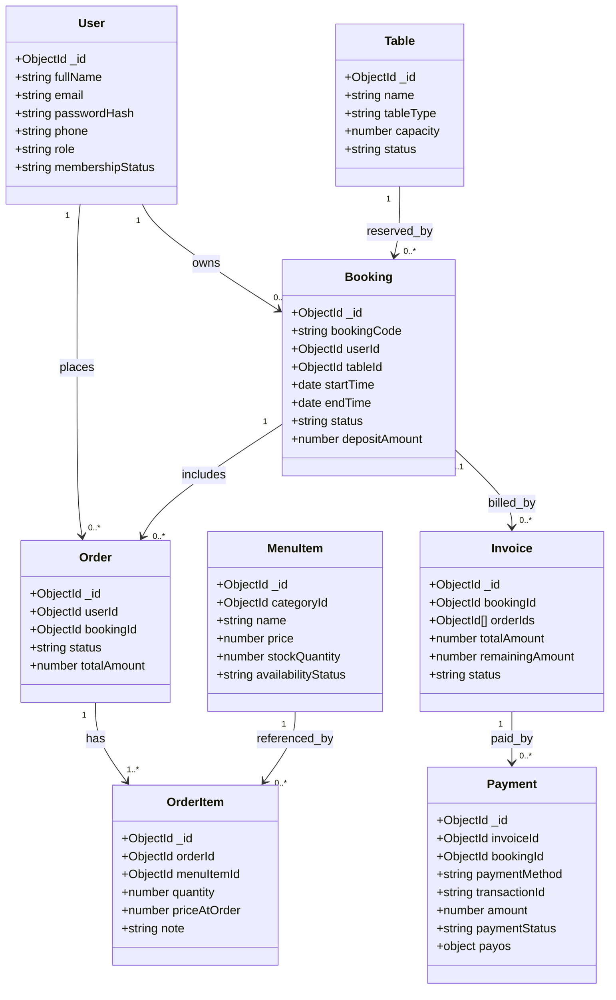
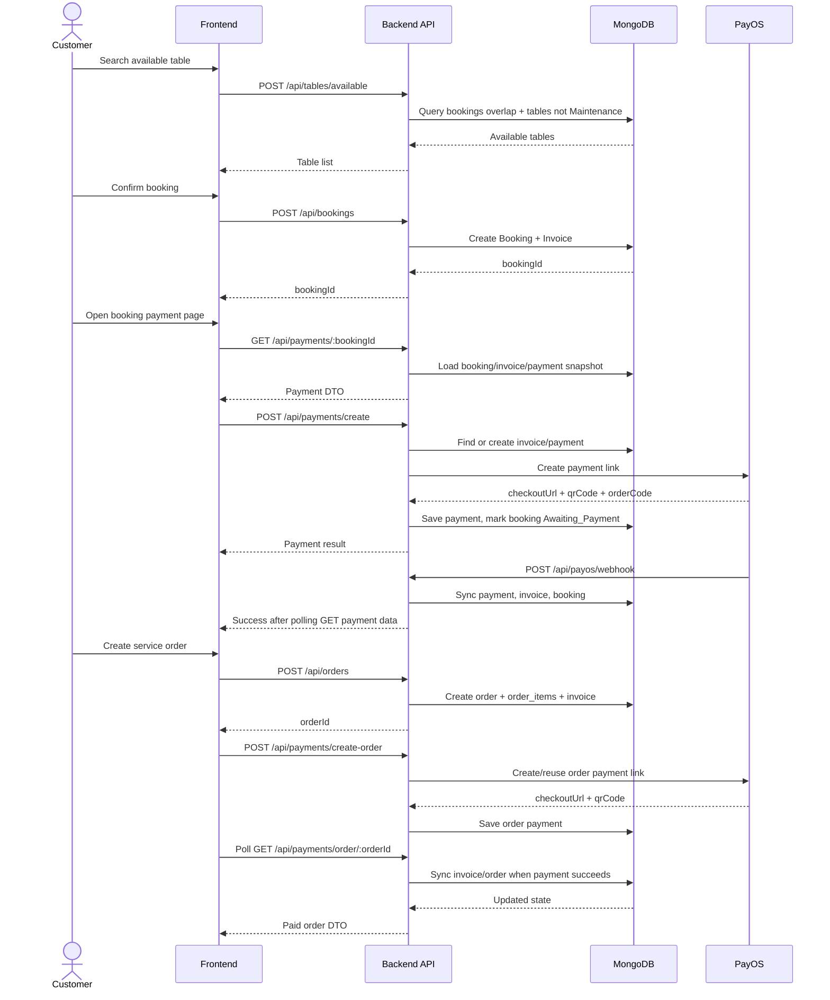
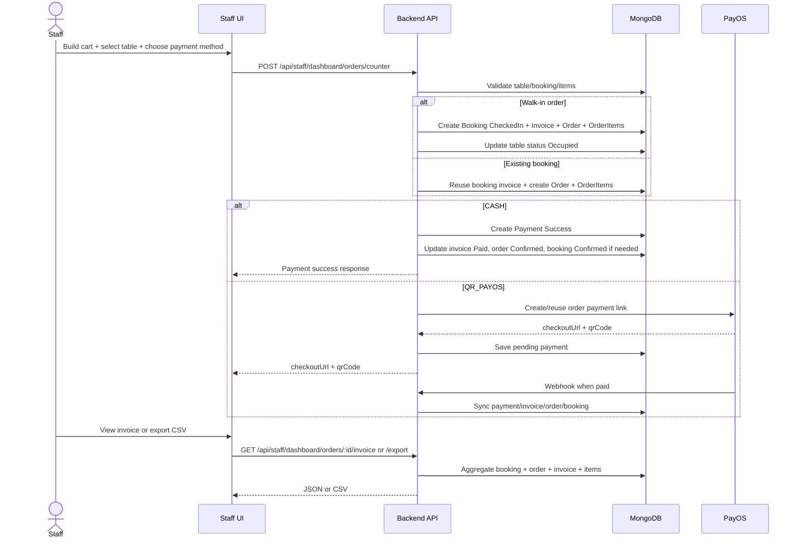

# SOFTWARE DESIGN SPECIFICATION (SDS)

## Project Information

- Project name: Coworking Space System
- Document type: Reverse-engineered SDS
- Source of truth: `backend/`, `frontend/`, `DATABASE/`
- Baseline date: 2026-03-25

## I. Overview

### 1. Code Packages

#### Backend packages

| Package | Main files | Responsibility |
| --- | --- | --- |
| `config/` | `db.js` | Ket noi MongoDB bang `MONGODB_URI` hoac `MONGO_URI`. |
| `controllers/` | `auth.controller.js`, `booking.controller.js`, `order.controller.js`, `payment.controller.js`, `staff-dashboard.controller.js`, `report.controller.js`, `menu.controller.js`, `table.controller.js`, `table-type.controller.js`, `user.controller.js` | Chua business logic xu ly request/response cho tung domain. |
| `routes/` | `route.js`, `*.routes.js` | Gom va mount toan bo API route duoi `/api`. |
| `models/` | `user.js`, `booking.js`, `order.js`, `order_item.js`, `invoice.js`, `payment.js`, `table.js`, `tableType.js`, `menu_item.js`, `category.js` | Dinh nghia collection schema MongoDB qua Mongoose. |
| `services/` | `payos.service.js`, `email.service.js` | Tich hop he thong ngoai: PayOS, email OTP, helper sync payment. |
| `middleware/` | `middleware.js` | JWT authentication va role authorization. |
| `constants/` | `domain.js` | Khai bao enum/trang thai va helper normalize. |
| Root runtime | `server.js`, `scheduler.js` | Khoi tao Express server, mount routes, bat scheduler auto-expire booking. |
| `scripts/` | `seed-database-from-json.js`, `seed-hourly-analytics.js`, `seed-bookings-range.js` | Seed va tao du lieu phuc vu demo/bao cao. |

#### Frontend packages

| Package | Main files | Responsibility |
| --- | --- | --- |
| `pages/shared/` | `HomeNew.jsx`, `Login.jsx`, `Register.jsx`, `ForgotPassword.jsx`, `OrderPage.jsx`, `PaymentPage.jsx`, `DashboardEntry.jsx`, `AdminToDashboard.jsx` | Public pages, auth entry points, dung chung payment page va route redirects. |
| `pages/customer/` | `BookingPage.jsx`, `OrderHistory.jsx`, `CustomerPassword.jsx`, `routes/CustomerProfilePage.jsx` | Booking/order flow, profile/password cua customer. |
| `pages/staff/` | `StaffDashboard.jsx`, `StaffCheckinPage.jsx`, `StaffSeatMapPage.jsx`, `StaffOrderManagementPage.jsx`, `StaffCounterOrderPage.jsx`, `StaffCreateServicePage.jsx`, `StaffServiceListPage.jsx`, `StaffProfilePage.jsx`, `StaffPasswordPage.jsx` | Van hanh staff, POS, quan ly order, seat map, profile. |
| `pages/admin/` | `AdminUsers.jsx`, `AdminTablesNew.jsx`, `AdminServiceListPage.jsx`, `AdminRevenuePage.jsx`, `AdminOccupancyPage.jsx`, `AdminProfileNew.jsx` | Admin CRUD va analytics dashboards. |
| `components/` | `admin/`, `customer/`, `staff/`, `common/` | Cac block UI va form component tai su dung. |
| `services/` | `api.js`, `bookingService.js`, `orderService.js`, `staffDashboardService.js`, `staffPaymentService.js` | HTTP client, wrappers cho API booking/order/staff/report. |
| Auth state | `hooks/useAuth.js`, `store/authSlice.js` | Dong bo local storage `token` + `user`, normalize role va logout flow. |
| Routing | `routes.js`, `root.jsx` | Dinh nghia route tree React Router va global app shell. |

### 2. Database Design

#### a. Database Schema

| Collection | Key fields | Relationships |
| --- | --- | --- |
| `users` | `fullName`, `email`, `passwordHash`, `phone`, `role`, `membershipStatus` | `bookings.userId`, `orders.userId` tham chieu `users._id`. |
| `bookings` | `bookingCode`, `userId`, `guestInfo`, `tableId`, `startTime`, `endTime`, `status`, `depositAmount` | Tham chieu `users`, `tables`; co the duoc lien ket voi `invoices` va `payments`. |
| `orders` | `userId`, `bookingId`, `status`, `totalAmount` | Tham chieu `users`, `bookings`; duoc nhung vao `invoices.orderIds[]`. |
| `order_items` | `orderId`, `menuItemId`, `quantity`, `priceAtOrder`, `note` | Tham chieu `orders` va `menu_items`. |
| `invoices` | `bookingId`, `orderIds[]`, `subTotal`, `discount`, `totalAmount`, `remainingAmount`, `status` | Co the gan mot booking, mot hoac nhieu order. |
| `payments` | `invoiceId`, `bookingId`, `paymentMethod`, `transactionId`, `amount`, `type`, `paymentStatus`, `payos` | Tham chieu `invoices`, `bookings`; nested `payos` luu metadata thanh toan online. |
| `tables` | `name`, `tableType`, `capacity`, `status`, `location`, `pricePerHour`, `pricePerDay` | Duoc tham chieu boi `bookings.tableId`. |
| `table_types` | `name`, `description`, `capacity` | Collection lookup rieng; hien tai `tables.tableType` van luu string. |
| `menu_items` | `name`, `categoryId`, `description`, `price`, `stockQuantity`, `availabilityStatus` | Tham chieu `categories`. |
| `categories` | `name`, `description`, `isActive` | Duoc tham chieu boi `menu_items.categoryId`. |

#### b. Table Description

| Table / Collection | Description |
| --- | --- |
| `users` | Tai khoan he thong cho customer, staff, admin. |
| `bookings` | Dat cho theo khung gio cho workspace/table. |
| `orders` | Don dich vu/menu gan voi booking. |
| `order_items` | Chi tiet tung mon trong order. |
| `invoices` | Hoa don tong hop cho booking deposit va/hoac order. |
| `payments` | Ban ghi giao dich thanh toan cash/payos va trang thai dong bo. |
| `tables` | Danh sach cho ngoi/ban/space co the booking. |
| `table_types` | Danh muc loai cho ngoi. |
| `menu_items` | Danh sach mon va dich vu. |
| `categories` | Danh muc menu. |

## II. Code Designs

### Booking -> Order -> Payment Workflow

Luong chinh duoc tach thanh 3 lop:

1. Frontend page/service thu thap du lieu va goi API.
2. Backend controller xu ly validation, quyen truy cap va orchestration.
3. Model/service lam viec voi MongoDB va PayOS/email.

### a. Class Diagram



### b. Class Specifications

#### Auth Controller

| Method | Description |
| --- | --- |
| `login` | Xac thuc bang email/phone + password, tao JWT 7 ngay, chan user `Suspended`. |
| `register` | Tao user customer moi, hash password, luu role customer. |
| `getMe` | Tra thong tin co ban cua user dang nhap. |
| `updateProfile` | Cap nhat `fullName`, `email`, `phone`; doi email can OTP verified session. |
| `changePassword` | Doi mat khau bang current/new/confirm password. |
| `sendOtp` | Tao OTP 6 chu so va gui email cho user dang nhap. |
| `verifyOtp` | Xac thuc OTP va tao verified session 10 phut trong memory. |

#### Booking Controller

| Method | Description |
| --- | --- |
| `createBooking` | Validate input dat cho, check overlap, tao booking `Pending`, tao invoice deposit. |
| `getMyBookings` | Tra danh sach booking cua current customer da map thong tin table. |
| `updateMyBooking` | Cho customer sua booking hop le va dong bo lai invoice. |
| `getAllBookings` | Staff/Admin lay danh sach booking theo bo loc date/search. |
| `checkInBooking` | Staff/Admin chuyen booking sang `CheckedIn` va update table status. |

#### Order Controller

| Method | Description |
| --- | --- |
| `getMyOrders` | Lay order cua current customer va populate items/booking status. |
| `createOrder` | Tao order `PENDING`, ghi `order_items`, tao invoice order. |
| `updateMyOrder` | Cho sua pending order va dong bo lai invoice. |

#### Payment Controller

| Method | Description |
| --- | --- |
| `getPaymentData` | Build DTO cho booking payment page. |
| `getOrderPaymentData` | Build DTO cho order payment page. |
| `createPayment` | Tao/reuse PayOS payment cho booking deposit. |
| `createOrderPayment` | Tao/reuse PayOS payment cho customer order. |
| `cancelPayment` | Huy booking payment dang pending. |
| `processCounterPayment` | Xu ly thanh toan tai quay cho staff bang `CASH` hoac `QR_PAYOS`. |
| `payosWebhook` | Nhan webhook va dong bo payment state. |

#### Staff Dashboard Controller

| Method | Description |
| --- | --- |
| `getStaffDashboardStats` | Tong hop KPI dashboard van hanh cho staff. |
| `getStaffTableStatusList` | Lay table list kem active booking hien tai. |
| `updateStaffTableStatus` | Doi trang thai table tai seat map. |
| `getStaffOrders` | Lay danh sach order theo search/status/date. |
| `createCounterOrder` | Tao order tai quay, co the tao walk-in booking, tao invoice va xu ly payment. |
| `updateStaffOrder` | Cap nhat item va transition status order theo flow. |
| `getStaffOrderInvoice` | Tong hop payload hoa don cho order. |
| `exportStaffOrderInvoice` | Export hoa don dang CSV. |

#### PayOS Service

| Method | Description |
| --- | --- |
| `isPayOSConfigured` | Kiem tra du bo ba key PayOS. |
| `createPayOSClient` | Khoi tao SDK client. |
| `createOrReusePayOSPayment` | Tao/reuse payment link cho booking deposit. |
| `createOrReuseOrderPayOSPayment` | Tao/reuse payment link cho order invoice. |
| `syncPayOSPaymentRecord` | Dong bo local payment/invoice/booking/order tu du lieu PayOS. |
| `cancelPayOSPayment` | Huy pending payment va local state booking/invoice. |
| `buildPaymentPageData` | Tao DTO payment page cho booking. |
| `buildOrderPaymentPageData` | Tao DTO payment page cho order. |

#### Email Service

| Method | Description |
| --- | --- |
| `sendOtpEmail` | Gui OTP qua Gmail SMTP hoac log console neu chua cau hinh. |
| `sendRegistrationEmail` | Helper gui welcome email qua Resend, hien chua duoc goi tu register controller. |
| `isEmailConfigured` | Kiem tra cau hinh gui email. |

### c. Sequence Diagram

#### Customer: Booking -> Order -> Payment



#### Staff POS flow



### d. Database Queries

#### Create booking

```js
const overlapping = await Booking.find({
  tableId,
  status: { $nin: ["Cancelled", "Canceled", "Completed"] },
  startTime: { $lt: endTime },
  endTime: { $gt: startTime },
});

const booking = await Booking.create({
  bookingCode,
  userId: req.user.id,
  guestInfo,
  tableId,
  startTime,
  endTime,
  status: "Pending",
  depositAmount,
});

await Invoice.create({
  bookingId: booking._id,
  totalAmount: depositAmount,
  remainingAmount: depositAmount,
  status: depositAmount > 0 ? "Pending" : "Paid",
});
```

#### Create order

```js
const booking = await Booking.findById(bookingId);
const menuItems = await MenuItem.find({
  _id: { $in: requestedItemIds },
}).lean();

const order = await Order.create({
  userId: req.user.id,
  bookingId,
  status: ORDER_STATUS.PENDING,
  totalAmount,
});

await OrderItem.insertMany(
  normalizedItems.map((item) => ({
    orderId: order._id,
    menuItemId: item.menuItemId,
    quantity: item.quantity,
    note: item.note,
    priceAtOrder: item.priceAtOrder,
  })),
);

await Invoice.create({
  orderIds: [order._id],
  totalAmount,
  remainingAmount: totalAmount,
  status: totalAmount > 0 ? "Pending" : "Paid",
});
```

#### Create payment

```js
const invoice = await Invoice.findOne({ bookingId: booking._id });
const payments = await Payment.find({ invoiceId: invoice._id }).sort({ createdAt: -1 });

const paymentLink = await payOS.paymentRequests.create({
  orderCode,
  amount: invoice.remainingAmount,
  description,
  returnUrl,
  cancelUrl,
  buyerName,
  buyerEmail,
  buyerPhone,
});

const payment = await Payment.create({
  invoiceId: invoice._id,
  bookingId: booking._id,
  paymentMethod: PAYMENT_METHOD.QR_PAYOS,
  transactionId: paymentLink.paymentLinkId,
  amount: invoice.remainingAmount,
  type: "Deposit",
  paymentStatus: "Pending",
  payos: {
    orderCode: paymentLink.orderCode,
    paymentLinkId: paymentLink.paymentLinkId,
    checkoutUrl: paymentLink.checkoutUrl,
    qrCode: paymentLink.qrCode,
    status: paymentLink.status,
  },
});
```

#### Important design notes

- Repository hien tai khong dung MongoDB transaction/session, nen luong tao booking/order/payment duoc dam bao bang cap nhat tuan tu va recalculate invoice sau moi buoc.
- `tables.tableType` la string, trong khi collection `table_types` ton tai rieng; mot so API public wrap gia tri nay thanh object `{ name }` de phu hop frontend.
- Frontend payment page dung mot component chung cho booking payment va order payment; behavior auto-cancel 5 phut chi ap dung cho booking payment.
- `AdminProfileNew.jsx` dang duoc tai su dung cho ca profile va password screens cua admin va staff.

## Current Implementation Constraints

- UI hien tai chua co OTP form cho doi email, du backend co API `send-otp` va `verify-otp`.
- `ForgotPassword.jsx` la placeholder page, chua co reset password workflow.
- Mot so frontend call dang hardcode `http://localhost:5000`, vi vay environment deploy can giong host backend hoac can refactor.
- File `frontend/src/pages/admin/AdminAnalytics.jsx` ton tai nhung khong co route active trong `frontend/src/routes.js`.
