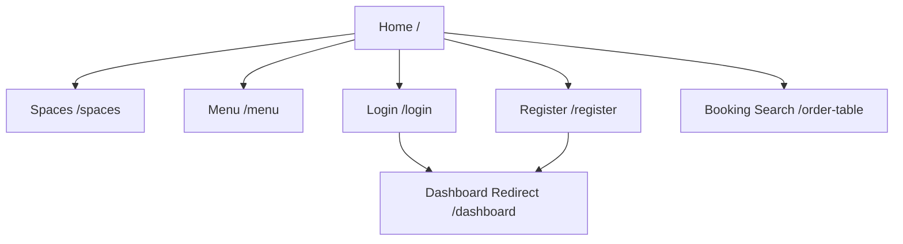
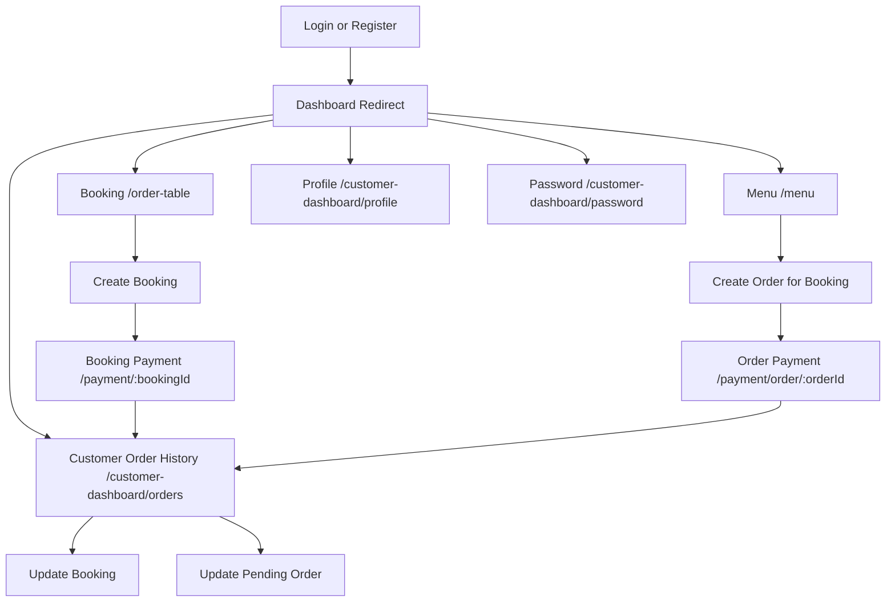
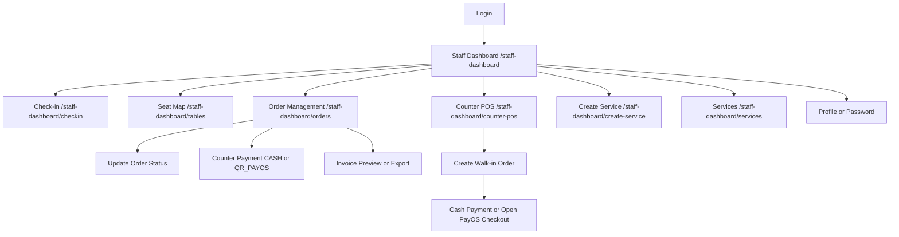
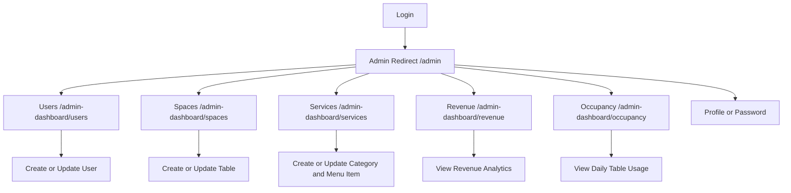
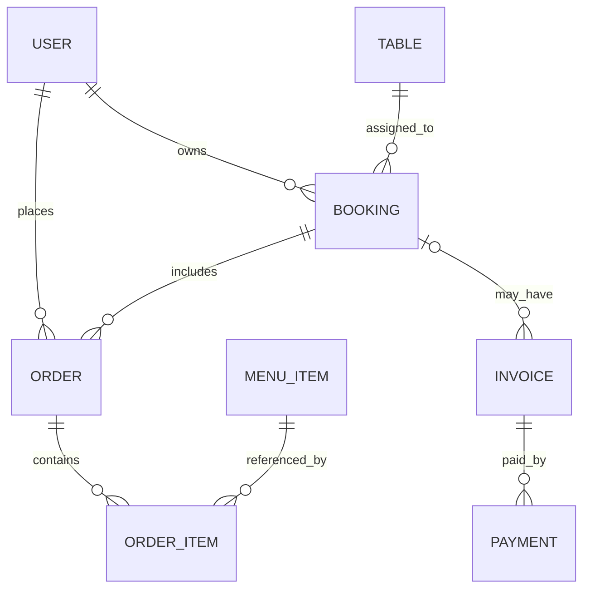

# SOFTWARE REQUIREMENTS SPECIFICATION (SRS)

## Project Information

- Project name: Coworking Space System
- Document type: Reverse-engineered SRS
- Source of truth: `backend/`, `frontend/`, `DATABASE/`
- Baseline date: 2026-03-25
- Scope note: Noi dung ben duoi mo ta he thong theo implementation hien tai trong repository, khong bo sung yeu cau ngoai code.

## I. Overview

### 1. Introduction

Coworking Space System la he thong quan ly dat cho, goi mon dich vu, thanh toan va bao cao van hanh cho mo hinh khong gian lam viec chung. He thong duoc tach thanh:

- Backend Express + MongoDB de xu ly API, xac thuc, booking, order, payment, report va POS staff.
- Frontend React Router + React Bootstrap de cung cap giao dien cho Guest, Customer, Staff va Admin.
- Seed data trong `DATABASE/` de the hien cau truc du lieu va cac trang thai nghiep vu dang duoc su dung.

#### Actors

| Actor | Mo ta |
| --- | --- |
| Guest | Nguoi dung chua dang nhap, chi xem duoc du lieu cong khai nhu menu, khong gian va danh sach cho ngoi. |
| Customer | Khach hang da dang nhap, co the dat cho, tao order, thanh toan va xem lich su booking/order cua chinh minh. |
| Staff | Nhan vien van hanh, phu trach check-in, theo doi cho ngoi, xu ly order tai quay, POS, in/export hoa don va cap nhat trang thai don. |
| Admin | Quan tri vien, phu trach quan ly user, spaces, services/menu, doanh thu va occupancy analytics. |

#### External Systems

| External system | Muc dich | Implementation hien tai |
| --- | --- | --- |
| PayOS | Tao QR thanh toan online cho booking deposit, customer order payment va staff POS QR payment | Tich hop qua `@payos/node`, xu ly trong `backend/src/services/payos.service.js` va webhook `/api/payos/webhook`. |
| Email OTP | Gui ma OTP de xac minh khi cap nhat thong tin | OTP email gui qua Gmail SMTP neu co `GMAIL_USER` va `GMAIL_APP_PASSWORD`; neu khong co thi backend log OTP ra console. |
| MongoDB | Luu tru du lieu nghiep vu | Truy cap qua Mongoose models trong `backend/src/models`. |

### 2. System Functions

#### a. Screen Flow

##### Guest/Public flow

##### Customer flow

##### Staff flow

##### Admin flow

#### b. Screen Details

| # | Feature | Screen | Route | Description |
| --- | --- | --- | --- | --- |
| 1 | Public landing | Home | `/` | Trang gioi thieu he thong, tai public tables va public menu items de hien thi tong quan. |
| 2 | Authentication | Login | `/login` | Dang nhap bang `identifier` (email hoac phone) va password, sau do luu JWT vao local storage. |
| 3 | Authentication | Register | `/register` | Dang ky tai khoan customer, sau khi dang ky thanh cong thi tu dong dang nhap. |
| 4 | Authentication | Forgot Password | `/forgot-password` | Trang huong dan placeholder; hien thong bao lien he admin, chua co reset password flow qua email. |
| 5 | Public catalogue | Spaces | `/spaces` | Trang gioi thieu khong gian/cho ngoi va CTA sang booking/menu. |
| 6 | Public catalogue | Menu | `/menu` | Xem category/menu cong khai; customer co the tao order neu da co booking hop le. |
| 7 | Booking | Booking Page | `/order-table` | Tim cho ngoi trong khoang thoi gian va tao booking sau khi dang nhap. |
| 8 | Payment | Booking Payment | `/payment/:bookingId` | Tai DTO thanh toan booking deposit, tao link PayOS neu co cau hinh, poll trang thai va tu dong cancel booking payment sau 5 phut pending. |
| 9 | Payment | Order Payment | `/payment/order/:orderId` | Tai DTO thanh toan order, tao link PayOS va poll trang thai thanh toan order. |
| 10 | Customer workspace | Order History | `/customer-dashboard/orders` | Xem lich su booking va order cua chinh minh, sua booking khi con cho phep, sua pending order, xem invoice summary. |
| 11 | Customer workspace | Profile | `/customer-dashboard/profile`, `/profile` | Sua thong tin ca nhan customer; UI goi thang `PUT /auth/profile`. |
| 12 | Customer workspace | Password | `/customer-dashboard/password` | Doi mat khau customer bang current/new/confirm password. |
| 13 | Navigation | Dashboard Redirect | `/dashboard` | Route helper dieu huong theo role sau khi dang nhap. |
| 14 | Staff dashboard | Dashboard | `/staff-dashboard` | Tong quan van hanh, thong ke tables, orders va recent activity. |
| 15 | Staff booking ops | Check-in | `/staff-dashboard/checkin` | Tim booking va thuc hien check-in cho booking da `Confirmed` hoac `Awaiting_Payment`. |
| 16 | Staff table ops | Seat Map | `/staff-dashboard/tables` | Xem danh sach ban/cho ngoi, active booking hien tai va doi trang thai table. |
| 17 | Staff order ops | Order Management | `/staff-dashboard/orders`, `/staff/orders` | Quan ly order, cap nhat status, cap nhat items, xu ly payment tai quay, xem/export invoice. |
| 18 | Staff POS | Counter POS | `/staff-dashboard/counter-pos` | Tao walk-in order tai quay, gan table/customer info tuy chon, thanh toan bang CASH hoac QR_PAYOS. |
| 19 | Staff POS | Create Service | `/staff-dashboard/create-service` | Giao dien staff tao order dich vu nhanh theo selected table va cart. |
| 20 | Staff catalogue | Service List | `/staff-dashboard/services` | Danh sach dich vu/menu cho staff voi loc theo category/status va tim kiem. |
| 21 | Staff account | Profile | `/staff-dashboard/profile` | Hien dang dung chung component voi admin profile/password. |
| 22 | Staff account | Password | `/staff-dashboard/password` | Hien dang dung chung component voi admin profile/password. |
| 23 | Admin user management | Users | `/admin-dashboard/users` | CRUD user, tim kiem theo role/status, soft deactivate user. |
| 24 | Admin table management | Spaces | `/admin-dashboard/spaces` | CRUD tables/spaces va quan ly table metadata. |
| 25 | Admin menu management | Services | `/admin-dashboard/services` | CRUD menu items va categories. |
| 26 | Admin analytics | Revenue | `/admin-dashboard/revenue` | Hien thi doanh thu, booking, recent payments va table type usage theo bo loc ngay/tuan/thang/nam. |
| 27 | Admin analytics | Occupancy | `/admin-dashboard/occupancy` | Lich cong suat theo thang, mo chi tiet tung ngay, goi report daily table usage va bookings by day. |
| 28 | Admin account | Profile | `/admin-dashboard/profile` | Hien dang dung chung component profile/password cho admin. |
| 29 | Admin account | Password | `/admin-dashboard/password` | Hien dang dung chung component profile/password cho admin. |
| 30 | Navigation | Admin Redirect | `/admin` | Route helper dieu huong admin/staff/customer den dashboard phu hop. |

#### c. User Authorization

Ghi chu:

- `V` = View
- `C` = Create
- `U` = Update
- `D` = Delete
- `-` = Khong ho tro theo nghiep vu tren UI hien tai
- Ma tran ben duoi mo ta quyen nghiep vu cua man hinh hien tai; mot so route cong khai van co the truy cap URL, nhung khong tao ra thao tac nghiep vu neu role khong phu hop.

| Screen | Guest | Customer | Staff | Admin |
| --- | --- | --- | --- | --- |
| Home | V | V | V | V |
| Login / Register / Forgot Password | V/C | V | V | V |
| Spaces | V | V | V | V |
| Menu | V | V/C | V | V |
| Booking Page | V | V/C | - | - |
| Booking Payment | - | V/C | - | - |
| Order Payment | - | V/C | - | - |
| Customer Order History | - | V/U | - | - |
| Customer Profile | - | V/U | - | - |
| Customer Password | - | V/U | - | - |
| Staff Dashboard | - | - | V | - |
| Staff Check-in | - | - | V/U | - |
| Staff Seat Map | - | - | V/U | - |
| Staff Order Management | - | - | V/C/U | - |
| Staff Counter POS | - | - | V/C/U | - |
| Staff Create Service | - | - | V/C | - |
| Staff Service List | - | - | V | - |
| Staff Profile / Password | - | - | V/U | - |
| Admin Users | - | - | - | V/C/U/D |
| Admin Spaces | - | - | - | V/C/U/D |
| Admin Services | - | - | - | V/C/U/D |
| Admin Revenue | - | - | - | V |
| Admin Occupancy | - | - | - | V |
| Admin Profile / Password | - | - | - | V/U |

#### d. Non-Screen Functions

| Function | Mo ta implementation hien tai |
| --- | --- |
| JWT Authentication | Backend phat JWT 7 ngay trong `/api/auth/login`; frontend luu `token` va `user` vao local storage, gui qua `Authorization: Bearer <token>`. |
| Role-based authorization | Backend dung `requireAuth`, `requireStaff`, `requireAdmin`; frontend dung `AdminLayout` va redirect route helper theo role. |
| OTP Email | OTP luu tam trong memory cache backend, TTL 5 phut; xac thuc xong tao verified session 10 phut. OTP email gui qua Gmail SMTP neu co config, neu khong thi log console. |
| PayOS Payment | Tao/reuse QR payment cho booking, order va counter POS; co webhook sync, poll trang thai va cancel pending payment. |
| Scheduler | `backend/src/scheduler.js` quet booking `Pending` va `Awaiting_Payment` qua 30 phut de auto-cancel. |
| MongoDB consistency | He thong cap nhat bang chuoi lenh Mongoose lien tiep; repository hien tai khong su dung `startSession`, `withTransaction` hay transaction MongoDB minh dinh. |

### 3. Entity Relationship Diagram

#### Entity and key notes

| Entity | Primary key | Foreign keys / relation fields | Ghi chu |
| --- | --- | --- | --- |
| User | `_id` | - | `email` unique, luu `role`, `membershipStatus`, `passwordHash`. |
| Booking | `_id` | `userId -> User`, `tableId -> Table` | Ho tro ca customer booking va walk-in booking (`userId` co the null, thong tin luu trong `guestInfo`). |
| Order | `_id` | `userId -> User`, `bookingId -> Booking` | Order customer va staff deu gan voi booking; order status enum nam trong `constants/domain.js`. |
| OrderItem | `_id` | `orderId -> Order`, `menuItemId -> MenuItem` | Luu snapshot gia tai thoi diem order trong `priceAtOrder`. |
| Invoice | `_id` | `bookingId -> Booking`, `orderIds[] -> Order` | Invoice co the chi cho booking deposit, chi cho order, hoac gom booking + nhieu order trong counter flow. |
| Payment | `_id` | `invoiceId -> Invoice`, `bookingId -> Booking` | Ho tro `CASH` va `QR_PAYOS`, co nested payload `payos`. |
| Table | `_id` | - | Luu metadata cho cho ngoi/ban/space, `tableType` hien tai la string. |
| MenuItem | `_id` | `categoryId -> Category` | Public chi nhin thay item thuoc category active va con hang. |
| Category | `_id` | - | Danh muc menu, co `isActive`. |
| TableType | `_id` | - | Collection `table_types` co ton tai, nhung `Table.tableType` hien tai luu string thay vi ObjectId FK. |

## II. Functional Requirements

### 1. Booking

| Function | Trigger | Validation | Business logic | Edge case |
| --- | --- | --- | --- | --- |
| Search available tables | Guest/Customer submit form tren `/order-table` | Bat buoc co ngay, gio bat dau va duration hoac endTime hop le | Backend `POST /api/tables/available` tinh `endTime`, loai table dang `Maintenance`, tim booking overlap va tra danh sach table con trong | `tableType` duoc loc bang so sanh chuoi, response tra `tableType: { name }` thay vi string |
| Create booking | Customer nhan confirm booking | Bat buoc dang nhap, co table, date/time hop le, duration > 0 | Backend tao `Booking` status `Pending`, tinh `depositAmount` tu `pricePerHour * duration`, dong thoi tao `Invoice` cho deposit | Khong cho dat neu co booking overlap tren cung table va status khac `Cancelled`, `Canceled`, `Completed` |
| Update own booking | Customer sua booking tu Order History | Chi cho booking thuoc user dang nhap; khong cho sua neu status la `Confirmed`, `Cancelled`, `Canceled` | Backend cap nhat `guestInfo`, `startTime`, `endTime`, `depositAmount`, dong bo lai invoice `totalAmount`, `remainingAmount`, `status` | Neu invoice da co payment success mot phan hoac toan bo thi `remainingAmount` duoc tinh lai |
| View own bookings | Customer mo Order History | Can JWT hop le | Backend tra booking da map kem thong tin table va gia tien de frontend hien thi lich su | Walk-in booking `userId = null` se khong hien trong lich su customer |
| Staff booking list and check-in | Staff mo `/staff-dashboard/checkin` hoac `/bookings/all` | Staff/Admin only; `checkIn` chi cho booking `Confirmed` hoac `Awaiting_Payment` | `checkIn` chuyen booking sang `CheckedIn` va set table status `Occupied` | Booking `Pending` chua duoc check-in truc tiep |

### 2. Order

| Function | Trigger | Validation | Business logic | Edge case |
| --- | --- | --- | --- | --- |
| Browse public menu | Guest/Customer mo `/menu` | Khong can dang nhap de xem | Backend `GET /api/menu/items` chi tra item thuoc category active va availability `AVAILABLE` | Staff/Admin co the yeu cau scope day du qua `admin=true` va token hop le |
| Create customer order | Customer submit cart tren `/menu` | Bat buoc dang nhap, bat buoc co `bookingId`, cart khong rong, quantity > 0 | Backend tao `Order` status `PENDING`, tao `OrderItem`, tao `Invoice` rieng cho order | Booking `Cancelled` hoac `Canceled` bi chan; item khong hop le bi loai bo trong qua trinh normalize |
| Update own order | Customer sua order trong Order History | Chi cho order thuoc user dang nhap va status normalized la `PENDING` | Backend thay toan bo order items, tinh lai `totalAmount`, cap nhat invoice lien quan | Khong cho sua order da `CONFIRMED`, `PREPARING`, `SERVED`, `COMPLETED`, `CANCELLED` |
| Staff update order | Staff cap nhat order tai `/staff-dashboard/orders` | Staff/Admin only; status moi phai hop le theo `ORDER_FLOW` | Backend cho phep cap nhat items va transition trang thai theo flow `PENDING -> CONFIRMED -> PREPARING -> SERVED -> COMPLETED`, hoac `PENDING -> CANCELLED` | Invoice duoc tinh lai theo tong item moi va tong so tien da thanh toan |
| View order history | Customer/Staff mo man hinh order | JWT hop le va dung role | Customer chi nhin thay order cua chinh minh; staff nhin thay toan bo order theo bo loc status/date/search | Order co the gan voi booking customer hoac booking walk-in do staff tao |

### 3. Payment

| Function | Trigger | Validation | Business logic | Edge case |
| --- | --- | --- | --- | --- |
| Load booking payment data | Customer mo `/payment/:bookingId` | Booking phai ton tai va thuoc user dang nhap | Backend build DTO gom booking, invoice, payment, flags `payosEnabled`, `canPay`, `canCancel`, thong tin QR neu da co pending payment | Frontend se poll lai du lieu trong luc pending |
| Create booking PayOS payment | PaymentPage auto-call hoac user retry | Bat buoc booking thuoc user; PayOS phai duoc cau hinh | Backend tao hoac reuse pending PayOS link, set booking sang `Awaiting_Payment` neu can | Neu PayOS loi ket noi thi API tra loi va frontend dung auto-retry khi gap critical error |
| Cancel booking payment | Booking payment page bi het timer hoac customer cancel | Chi booking owner moi huy duoc | Backend huy pending payment va cap nhat booking/invoice ve `Cancelled` neu dang cho thanh toan | Logic huy hien tai ap dung cho booking payment; payment order khong dung auto-cancel 5 phut |
| Load order payment data | Customer mo `/payment/order/:orderId` | Order phai ton tai va thuoc user dang nhap | Backend build DTO cho order, items, invoice va payment hien co | Order payment page dung chung component PaymentPage voi booking payment |
| Create order PayOS payment | PaymentPage auto-call tren route order payment | Bat buoc order thuoc user; PayOS da cau hinh | Backend tao hoac reuse pending link cho invoice chua order do | Return path va cancel path duoc gan theo route customer order payment |
| Counter cash payment | Staff xu ly thanh toan tai quay | Staff/Admin only; method phai la `CASH`; can tim thay order/invoice/booking tuong ung | Backend tao `Payment` status `Success`, set invoice `Paid`, confirm order neu dang `PENDING`, confirm booking neu dang `Pending` hoac `Awaiting_Payment` | Co the goi qua `/api/staff/payment/counter` tu man staff order management |
| Counter QR payment | Staff chon `QR_PAYOS` o POS/order management | Staff/Admin only; PayOS da cau hinh | Backend tao/reuse PayOS payment cho invoice hien tai va tra `checkoutUrl`, `qrCode` | Counter QR co the ap dung cho existing booking hoac walk-in booking |
| PayOS webhook sync | PayOS goi `/api/payos/webhook` | Payload webhook hop le theo PayOS | Backend xac minh webhook, dong bo `paymentStatus`, `payos.status`, invoice `remainingAmount`, booking status va order status | Backend cung sync lai pending payment khi user mo payment page |

### 4. POS

| Function | Trigger | Validation | Business logic | Edge case |
| --- | --- | --- | --- | --- |
| Create walk-in counter order | Staff submit form tren `/staff-dashboard/counter-pos` khong co `bookingId` | Bat buoc co `tableId`, items hop le; neu co `durationHours` thi phai > 0; payment method neu truyen vao chi nhan `CASH` hoac `QR_PAYOS` | Backend tao booking walk-in `CheckedIn`, set table `Occupied`, tao/reuse invoice theo booking, tao order + order items, xu ly payment neu co method | `userId` co the null, thong tin khach duoc luu trong `guestInfo` |
| Create counter order for existing booking | Staff submit counter order co `bookingId` | Booking phai ton tai va khong nam trong `Cancelled`, `Canceled`, `Completed` | Backend them order vao invoice booking hien co hoac tao invoice neu chua co | Gop order vao invoice booking thay vi tao invoice order rieng |
| Quick service order | Staff dung `/staff-dashboard/create-service` | Bat buoc chon table va cart khong rong | Frontend goi chung `createCounterOrder`, phuc vu tao order dich vu nhanh | Hien tai man hinh nay khong xu ly QR thanh toan truc tiep, chi tao order |
| Invoice preview and export | Staff xem invoice tu order management | Staff/Admin only | Backend tong hop booking, customer, items, totals va tra JSON hoac CSV export | Frontend export invoice dang goi URL hardcode `http://localhost:5000/api/...` |
| Table status management | Staff doi status trong seat map | Trang thai moi phai thuoc `Available`, `Occupied`, `Reserved`, `Maintenance`, `Cleaning` | Backend cap nhat table status truc tiep | Khong co workflow transaction lien ket voi booking khi staff doi status thu cong |

### 5. Report

| Function | Trigger | Validation | Business logic | Edge case |
| --- | --- | --- | --- | --- |
| Revenue analytics | Admin mo `/admin-dashboard/revenue` | Admin only | Backend tong hop payments, bookings, orders, invoices de tinh `summary`, `revenueByMonth`, `occupancyByPeriod`, `tableTypeUsage`, `recentPayments`, `recentBookings` | `timeFilter` hien tai nhan chuoi giao dien `Ngay`, `Tuan`, `Thang`, `Nam` |
| Hourly occupancy analytics | Frontend goi `/api/reports/analytics/hourly` | Admin only | Backend tra hourly capacity va peak window theo ngay/tuan/thang | Opening hour/closing hour mac dinh la 7-19 |
| Daily table usage calendar | Admin mo `/admin-dashboard/occupancy` | Admin only | Backend tinh `dailyUsage` theo tung ngay trong thang, tong so ban da dung, occupancyRate, bookingCount, bookingsWithoutTable | Frontend mo modal chi tiet ngay va tiep tuc goi `GET /api/bookings/all?date=...` |
| Staff access restriction | Staff thu vao route report | `requireAdmin` | Staff bi chan truy cap bao cao tai backend | Frontend staff khong co route report rieng |

## Current Implementation Notes

- OTP API ton tai cho `UPDATE_PROFILE` va `CHANGE_PASSWORD`, nhung UI hien tai chua co man hinh nhap OTP.
- `PUT /api/auth/profile` se chan doi email neu chua verify OTP; vi vay customer/staff/admin profile UI hien tai chi an toan khi sua `fullName` va `phone`, hoac khi email khong thay doi.
- `PUT /api/auth/password` co goi `ensureOtpVerified(...)` nhung khong chan khi OTP chua duoc xac thuc; nghia la doi mat khau hien tai van duoc xu ly bang current/new/confirm password.
- Frontend co mot so API hardcode `http://localhost:5000`, can duoc tinh den khi deploy.
- `frontend/src/pages/admin/AdminAnalytics.jsx` ton tai trong codebase nhung chua duoc dang ky trong `frontend/src/routes.js`.
