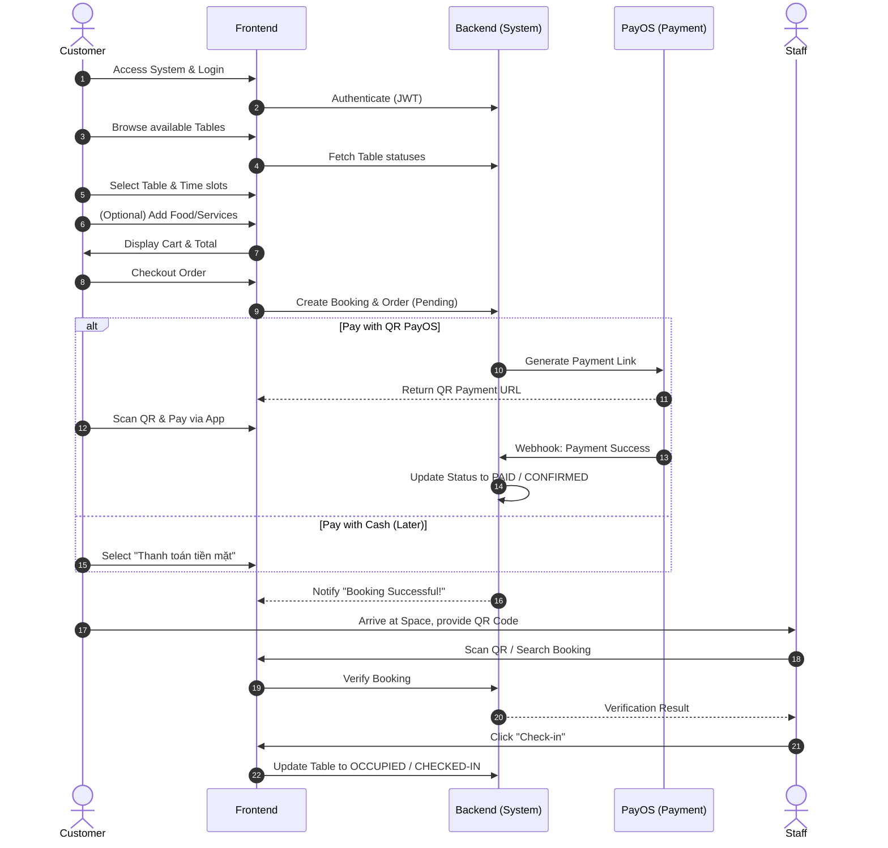
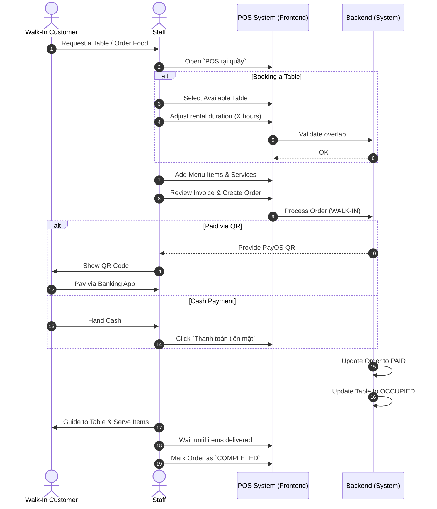
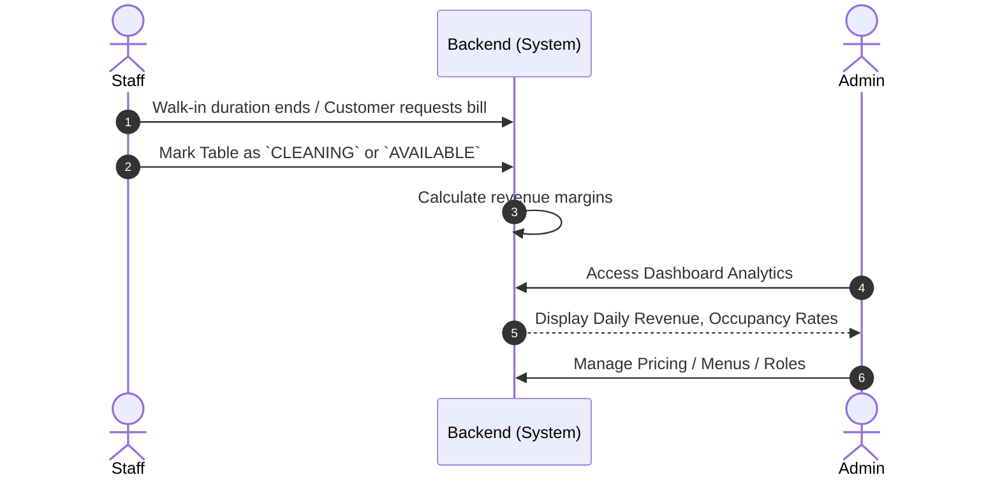

# Main Workflow - Coworking Space Manager

This document illustrates the core business workflows of the Coworking Space Manager system using Mermaid Swimlane Diagrams.

## 1. Online Booking & Ordering Flow (Customer)

This flow describes the journey of a Customer booking a workspace remotely, ordering food/drinks, and checking in.

## 2. In-Store POS & Walk-in Flow (Staff)

This flow represents a Walk-in Customer booking a table or buying food directly at the counter.

## 3. Post-service & Reporting (Admin)

