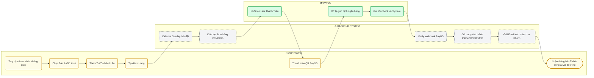
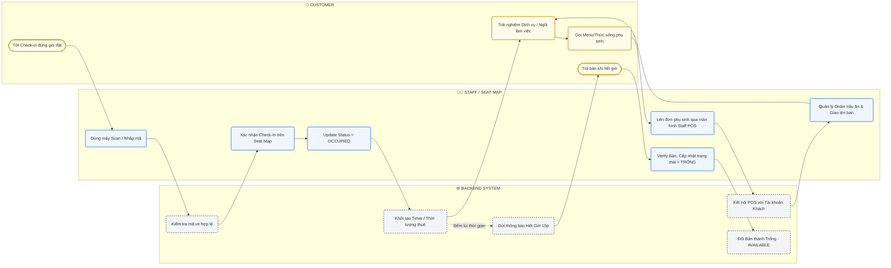

# Coworking Space Manager - Main Workflows

Tài liệu này tổng hợp 3 luồng nghiệp vụ (Workflow) chính nhất của hệ thống, được vẽ dưới dạng **Swimlane Flowchart** giúp mô phỏng chân thực sự tương tác chéo giữa các bên: Khách hàng, Hệ thống, Cổng thanh toán, và Nhân viên.

---

## 1. Luồng Đặt Bàn & Đặt Món Online (Customer Booking)

Mô tả luồng từ lúc khách hàng tìm kiếm chỗ ngồi trên web, chọn giờ thuê, thanh toán qua cổng PayOS và kết thúc với việc hệ thống xác nhận.

---

## 2. Luồng Khách Vãng Lai & Màn Hình POS (Walk-in & In-Store Ordering)

Mô tả luồng khi khách vãng lai đi thẳng tới chi nhánh, nhân viên tiếp tân dùng giao diện POS để thao tác xếp bàn và đặt đồ ăn.

```mermaid
flowchart LR
    %%{init: {"flowchart": {"curve": "basis", "padding": 20}, "theme": "default"}}%%

    subgraph Walkin ["🚶 WALK-IN CUSTOMER"]
        direction LR
        W1([Đến hỏi Lễ tân thuê bàn])
        W2(Yêu cầu Bàn + Chọn Món)
        W3(Quét mã QR PayOS / Đưa Tiền Mặt)
        W4([Nhận chỗ và sử dụng đồ ăn])
    end

    subgraph Staff ["🧑‍💼 STAFF POS"]
        direction LR
        T1(Mở giao diện POS)
        T2(Chọn Bàn còn trống)
        T3(Thêm món ăn vào Hóa đơn)
        T4(Chọn Thanh toán QR hoặc Tiền mặt)
        T5(Đưa QR / Nhận Tiền & Xác nhận Hoàn thành)
        T6(Giao đồ ăn đến Bàn)
    end

    subgraph System ["⚙️ BACKEND SYSTEM"]
        direction LR
        S1(Kiểm tra trùng lịch đặt trước mặt khác)
        S2(Khởi tạo đơn Walk-In)
        S3(Tạo Link PayOS cho Hóa Đơn)
        S4(Đổi trạng thái Đơn = PAID, Bàn = OCCUPIED)
    end

    subgraph PayOS ["💳 PAYOS"]
        direction LR
        P1(Tạo QR Code ảo)
        P2(Xử lý webhook)
    end

    W1 --> W2
    W2 --> T1
    T1 --> T2 --> T3 --> T4
    T4 --> S1
    S1 --> S2

    %% Tẽ nhánh thanh toán
    S2 --> S3
    S3 --> P1
    P1 --> T5
    T5 --> W3
    W3 --> P2
    P2 --> S4
    
    %% Trả kết quả
    S4 --> T6
    T6 --> W4

    classDef cust fill:#ffedd5,stroke:#c2410c,stroke-width:2px;
    classDef staff fill:#eff6ff,stroke:#3b82f6,stroke-width:2px;
    classDef sys fill:#f3f4f6,stroke:#4b5563,stroke-width:2px,stroke-dasharray: 4 4;
    classDef pay fill:#dcfce7,stroke:#16a34a,stroke-width:2px;
    
    class W1,W2,W3,W4 cust;
    class T1,T2,T3,T4,T5,T6 staff;
    class S1,S2,S3,S4 sys;
    class P1,P2 pay;
```

---

## 3. Luồng Check-in, Sử dụng & Trả Bàn (Table Session Lifecycle)

Mô tả vòng đời của một bàn từ lúc khách tới Check-in theo lịch đã đặt (hoặc Walk-in), gọi thêm món, quản lý thời gian, cho tới lúc trả bàn.

